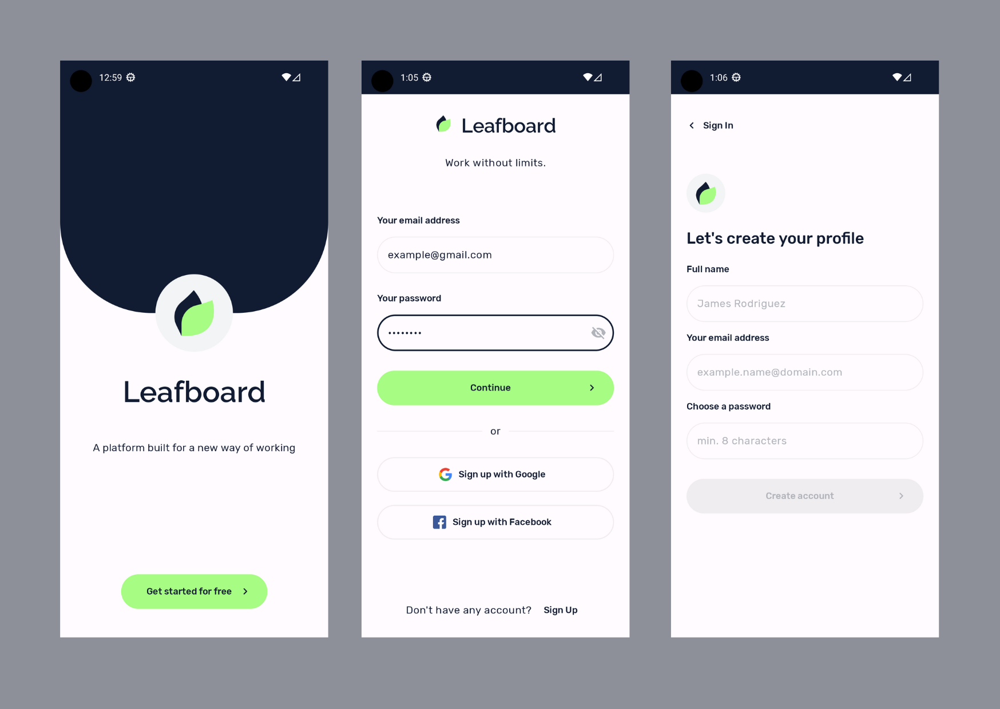

## Login system created with Jetpack Compose and Firebase

This app allows you to Sign in with Google and Facebook (Not implemented yet).
Note: Make sure to add the google-services.json, previously created in [Firebase console](https://console.firebase.google.com/)

### Screenshots

### 🖼️ UI

The app contains a simple login system example that uses [Firebase Authentication](https://firebase.google.com/docs/auth?hl=es-419) and is created with Jetpack Compose

### 🧱 Build

* [KTS gradle files](https://docs.gradle.org/current/userguide/kotlin_dsl.html)
* [Version catalog](https://docs.gradle.org/current/userguide/platforms.html)
* Builded with a [base android template](https://github.com/LMedez/android-templates/tree/base-firebase)

### 🏠 Architecture

* [Room Database](https://developer.android.com/training/data-storage/room) *not implemented yet*
* [Firebase as service](https://firebase.google.com/)
* Dependency injection with [Koin](https://insert-koin.io/)
* [Jetpack ViewModel](https://developer.android.com/topic/libraries/architecture/viewmodel)
* UI using [Jetpack Compose](https://developer.android.com/jetpack/compose) and
  [Material3](https://developer.android.com/jetpack/androidx/releases/compose-material3)
* [Jetpack Navigation](https://developer.android.com/jetpack/compose/navigation)
* [Reactive data layer](https://developer.android.com/topic/architecture/data-layer)
* [Kotlin Coroutines and Flow](https://developer.android.com/kotlin/coroutines)
* [Unit tests](https://developer.android.com/training/testing/local-tests) *not implemented yet*
